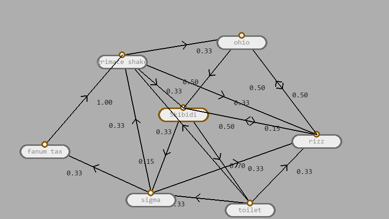

# Markov-chain-sentence

A Markov chain sentence generator, made using pygame!

## How to use it
After you open either the .exe or the .py files downloaded from the github page, you'll see a screen with an object labled test that you can drag around. To add a new "node", press the tan button in the left corner. To change the text in a node, simply click on it and type! After that, you'll want to either make more nodes or link them together. To do that, simply press the little circular button at the top of the node, then press another one, and a link will be formed between the first node and the second. The number represents the probability of that node being "chosen" in the Markov chain, between 0 and 1. If you want to delete a node, make it "active" by clicking on it then press the black button in the corner. Finally, to run the Markov chain, click the node you want to start on, then press the red button, turning it green. The program will generate the sentence until you press it again!

Enjoy!